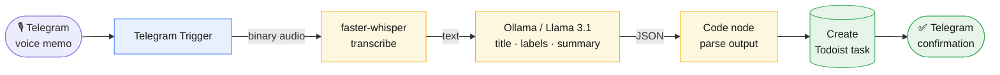

# 🎙️ Voice Notes → Todoist (100% local, free)

An [n8n](https://n8n.io) workflow that turns a voice memo into an organized task.
Send a voice message to a Telegram bot and it will:

1. **Transcribe** the audio with **Whisper** (running locally via `faster-whisper`)
2. **Generate a title, labels, and a summary** with a **local LLM** (Ollama / Llama 3.1) — no GPT-4o bill
3. **Save it as a task** in **Todoist**
4. **Reply** in Telegram to confirm

No paid APIs. Everything runs on your own machine with Docker.

## Architecture

```
Telegram voice memo
        │
        ▼
 ┌──────────────┐   binary    ┌─────────────────┐   text   ┌──────────────────┐
 │  Telegram    │ ──────────► │  faster-whisper │ ───────► │   Ollama (LLM)   │
 │  Trigger     │             │  (transcribe)   │          │ title/labels/sum │
 └──────────────┘             └─────────────────┘          └──────────────────┘
                                                                     │ JSON
                                                                     ▼
                                                            ┌──────────────────┐
                                                            │  Create Todoist  │
                                                            │      task        │
                                                            └──────────────────┘
                                                                     │
                                                                     ▼
                                                            Telegram confirmation
```

<details>
<summary>Same diagram, rendered as a graph (GitHub)</summary>



</details>

> Blue = capture, amber = AI enrichment, green = write-back / notify.

## The real point: automating task flows

This repo is really about **using n8n to automate a task flow end-to-end** — something comes in, an AI step does the thinking, and the result lands in the tools you already use, with no manual copy-paste in between. The voice-note organizer is just a small personal example I could run on my own hardware. The same skeleton — *trigger → AI enrichment → structured write-back → notify* — scales straight into real work.

**Example: an investment deal-flow assistant.** A new deal/opportunity arrives (inbound email, a form, a CRM entry). An analyst agent reads it, reasons about it, and drafts notes; the notes get saved to Google Drive; and a running **master list is updated and re-ranked best-to-worst** so the team always sees the top opportunities first — with a Slack ping when something scores highly.

```
New deal in  ->  Analyst agent (assess + draft notes)  ->  save notes to Drive  ->  upsert + re-rank master list  ->  Slack alert on top deals
```

It's the exact same five building blocks as the personal version — only the connectors change:

| This project (personal) | Deal-flow assistant (work) | Role in the pattern |
|---|---|---|
| **Telegram Trigger** (voice memo) | **Email / form / CRM trigger** (new deal) | Capture an incoming event |
| **faster-whisper** (audio → text) | *(skip — deal is already text)* | Normalize input to text |
| **Ollama**: title / labels / summary | **Analyst agent**: assess, score, draft notes | AI enrichment → structured JSON |
| **Code node** parses JSON | **Code node** parses + re-ranks the list | Validate output / apply logic |
| **Create Todoist task** | **Save notes to Drive + update master list** | Structured write-back to a system of record |
| **Telegram confirmation** | **Slack alert** on top-ranked deals | Close the loop / notify |

Other variations on the identical pattern: support-inbox triage and routing, CRM lead enrichment and scoring, invoice intake → accounting. Learn this one workflow and you've learned the reusable skeleton — production builds just swap the trigger and the destination.

## Prerequisites

- [Docker](https://docs.docker.com/get-docker/) + Docker Compose
- A Telegram bot token (create one via [@BotFather](https://t.me/botfather))
- A Todoist API token (Settings → Integrations → Developer)

## Setup

```bash
# 1. Configure secrets
cp .env.example .env        # then edit .env with your tokens

# 2. Start n8n + Ollama + Whisper
docker compose up -d

# 3. Pull the local model (one-time, ~5 GB)
docker compose exec ollama ollama pull llama3.1:8b

# 4. Open n8n and import the workflow
#    http://localhost:5678  ->  Workflows -> Import from File -> workflow.json
```

After importing, open the workflow and:

- Add **Telegram** credentials (your bot token) to the *Telegram Trigger*, *Download Voice File*, and *Confirm in Telegram* nodes.
- Add **Todoist** credentials to the *Create Todoist Task* node.
- Click **Active** to enable the trigger.

Then send your bot a voice message. 🎉

## Configuration

| Variable | Default | Notes |
|---|---|---|
| `OLLAMA_MODEL` | `llama3.1:8b` | Any Ollama model; smaller = faster |
| `WHISPER_MODEL` | `faster-whisper-base.en` | Use `small`/`medium` for better accuracy |

The LLM is prompted to return strict JSON (`title`, `labels`, `summary`). A **Code** node parses it before the Todoist step — the most common place to tweak behavior.

## Cost

**$0.** Whisper and the LLM run locally. The only "cost" is disk space (~5 GB for the model) and your machine's compute.

## Limitations / ideas

- Whisper requests are best for memos under a few minutes; long recordings should be chunked.
- Todoist **labels** require a Todoist Pro plan — on free, labels are ignored (title + summary still work).
- **Swap the model freely.** The LLM step is just an HTTP call that returns JSON, so Ollama isn't required — point `OLLAMA_URL`/`OLLAMA_MODEL` at any other local model (Mistral, Qwen, Phi), or change the node to hit a hosted API (OpenAI GPT-4o, Anthropic Claude) if you want higher quality and don't mind paying. Nothing else in the pipeline changes.
- Swap the destination by replacing the *Create Todoist Task* node with a **Notion** or **Google Docs** node.
- Swap the trigger (Telegram → Google Drive / Webhook) without touching the rest of the pipeline.

## License

MIT
